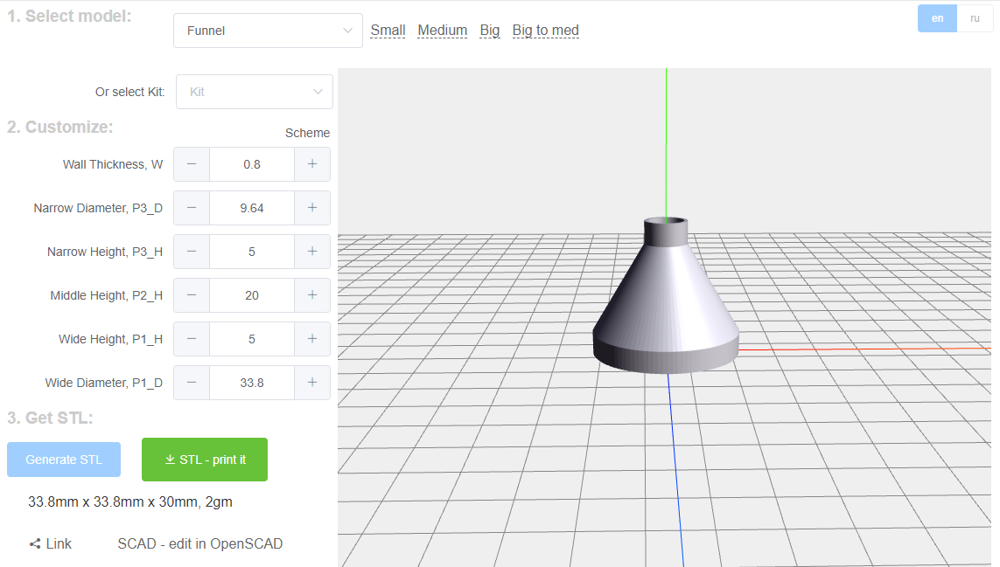

# SCAD customizable models in Web interface

## Features
- Generate SCAD and STL files for built-in models
- Send link to constructor, all settings will be encoded in URL
- STL filenames optimized for 30 symbols filename limit on printers
- Kits - model set from several models

## Models
- Funnel
- Shim
- Cup
- Cap
